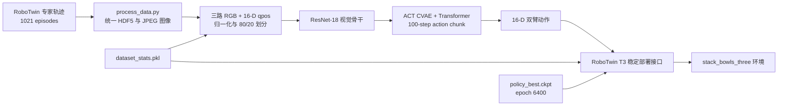

# TronCamp Mani：统一 T1–T4 ACT 训练与部署

> 本页是最终合并版本、技术设计与复现入口。主办方参赛包的任务说明、计分规则和通用工具文档见
> [原始 TronCamp README](./README_TRONCAMP.md)。

| 项目 | 内容 |
| --- | --- |
| 交付形态 | 一套共享实现 + T1–T4 四套薄配置 |
| T4 最终方案 | T3 稳定代码路径 + T4 模型结构与权重 |
| 覆盖任务 | `adjust_bottle`、`grab_roller`、`stack_bowls_two`、`stack_bowls_three` |
| 策略 | ACT（Action Chunking Transformer） |
| 文档版本 | 1.0，2026-07-20 |
| 代码基线 | `3b0e468`（`Configure ACT for T3 bowl stacking`）及本文所列兼容性改动 |

## 项目定位

本项目不是重新发明 ACT 模型或 RoboTwin 平台，而是在主办方代码基础上完成一个可训练、可恢复、可选择最佳权重、可按 T1–T4 清晰配置并可复现交付的统一版本。四个任务复用同一套数据接口、ACT 网络、训练循环、部署适配和评测入口；任务差异只保留在数据集、模型容量和少量训练参数中。

最终仓库因此采用“共享内核 + 薄配置”的结构，而不是维护四份逐渐分叉的训练代码：

```text
                         ┌─ train_T1.sh / deploy_policy_T1.yml
共享 ACT 训练与部署内核 ─┼─ train_T2.sh / deploy_policy_T2.yml
                         ├─ train_T3.sh / deploy_policy_T3.yml
                         └─ train_T4.sh / deploy_policy_T4.yml
```

## 主要贡献

以下是相对主办方初始代码、且能够由仓库差异直接核实的工程贡献。

### 贡献一：统一的 T1–T4 配置层

- 将四个赛道收敛到同一个 `train.sh`，只用 `train_T1.sh` 至 `train_T4.sh` 描述任务差异；
- 为四个赛道提供名称明确的部署 YAML，并让本地评测按 `--track` 自动选择；
- 保持训练与部署的 `chunk_size/hidden_dim/dim_feedforward` 成对一致，避免 checkpoint 形状不匹配；
- 补齐 T2 200-episode 和 T4 1021-episode 的可复现采集配置。

该设计的价值是：公共训练逻辑修复一次即可覆盖 T1–T4，不需要把同一 bug 在四份脚本中分别修复。

### 贡献二：可复用于 T1–T4 的稳定训练循环

训练改进全部放在共享的 `imitate_episodes.py` 中，不与具体任务绑定：

| 改进 | 实现 | 作用 |
| --- | --- | --- |
| 学习率调度 | `CosineAnnealingLR(T_max=num_epochs, eta_min=1e-6)` | 从初始学习率平滑衰减，四个赛道共用 |
| 稀疏验证 | 新增 `--val_freq`，并保证最后一个 epoch 必验 | 降低长训练的验证开销，同时保留最终结果 |
| 权重级续训 | 新增 `--resume_ckpt/--start_epoch`，同步推进 scheduler | 训练中断后可从指定 epoch 继续 |
| 最佳权重保护 | 验证改善时立即以临时文件 + `os.replace` 原子更新 | 异常退出时仍保留最近的最佳模型 |
| 训练数值保护 | 每个 batch 检查 NaN/Inf 并输出损失分量、epoch、batch 和 rank | 避免无效训练静默运行 |
| 续训统计修复 | 按当前 epoch 的最后若干 batch 汇总训练损失 | 修复从非零 epoch 恢复时的空切片/错误统计 |
| 可追踪日志 | 同时打印当前与历史最佳验证 epoch，并记录当前 LR | 便于选择和复核最终 checkpoint |

续训是“模型权重级续训”，不恢复 optimizer state；README 和日志均明确记录这一边界。DDP、ACT 主体、RoboTwin 环境和官方评测契约来自主办方基线，不作为本项目新增贡献申领。

### 贡献三：T4 最终权重的兼容集成与可复现交付

- 在 T3 稳定执行路径上对齐 T4 权重所需的 `hidden_dim=1024`、`dim_feedforward=4096` 和 `chunk_size=100`；
- 注册 1021 条三碗堆叠数据，完成 8000 epochs 训练并按验证损失选择 epoch 6400 权重；
- 验证 230.32M 参数模型、三路相机顺序、归一化统计量与 checkpoint 全键匹配；
- 将代码、权重和本地运行产物分开交付，给出权重 SHA-256、完整复现命令和已知限制；
- 提交打包显式排除日志、数据、processed data 和 checkpoint，避免把本地产物混入开源代码。

## 复用边界

为避免把上游工作包装成本项目贡献，归属边界如下：

| 复用自主办方/上游 | 本项目新增或整理 |
| --- | --- |
| RoboTwin 仿真环境、Tron2 资产、四个任务与专家 | T1–T4 统一配置和命名入口 |
| ACT/CVAE/Transformer 模型主体 | 通用余弦学习率调度与训练可靠性改进 |
| DDP 基础训练能力与数据 loader | 续训、验证频率、最佳权重原子保存和数值保护 |
| 官方评测与提交协议 | track-aware 部署配置选择、精简打包与复现文档 |

## 1. 背景与目标

T4 要求 Tron2 双臂机器人把三个碗依次堆叠。系统需要同时处理三路 RGB 视觉、双臂关节与夹爪状态，并输出连续的双臂控制动作。最终交付采用已经跑通的 T3 ACT 数据、训练和部署代码作为执行基线，只把模型容量、任务数据和 checkpoint 切换到 T4 配置。

联调期间曾怀疑主 T4 分支存在执行问题，后续定位为评测/仿真环境侧问题。由于截止前没有足够时间重新完成整套回归，最终方案冻结为改动范围更小、接口已验证的“T3 代码 + T4 权重”，不继续引入主 T4 分支上的未验证改动。

设计目标如下：

1. 保持训练、推理和官方评测三者的观测与动作契约完全一致。
2. 使用 1021 条三碗堆叠轨迹训练更大容量的 ACT 模型。
3. checkpoint 与部署配置严格匹配，加载时所有参数键和形状一致。
4. 代码包不包含数据、日志或中间 checkpoint，权重通过赛事权重通道独立交付。
5. 对当前尚未完成的验证项作明确说明，不用离线损失替代真实成功率。

### 1.1 T1–T4 命名约定

训练与部署配置按赛道显式命名，避免只看 `train.sh` 或 `deploy_policy.yml` 时误用不同结构的 checkpoint：

| 赛道 | 任务 | 训练入口 | 部署配置 | 默认数据量 | 模型结构（chunk/hidden/FFN） |
| --- | --- | --- | --- | ---: | --- |
| T1 | `adjust_bottle` | `train_T1.sh` | `deploy_policy_T1.yml` | 200 | 50 / 512 / 3200 |
| T2 | `grab_roller` | `train_T2.sh` | `deploy_policy_T2.yml` | 200 | 50 / 512 / 3200 |
| T3 | `stack_bowls_two` | `train_T3.sh` | `deploy_policy_T3.yml` | 400 | 100 / 768 / 3200 |
| T4 | `stack_bowls_three` | `train_T4.sh` | `deploy_policy_T4.yml` | 1021 | 100 / 1024 / 4096 |

四个命名脚本只保存各赛道的差异参数，公共命令由 `train.sh` 统一生成，以免复制四份训练逻辑后发生漂移。`deploy_policy.yml` 作为官方评测入口的兼容默认文件保留，并与最终的 `deploy_policy_T4.yml` 保持一致；本地评测会根据 `--track` 自动选择对应的命名配置。

## 2. 系统总览



系统分成四层：

- 数据层：采集 RoboTwin 原始轨迹，转为 ACT 使用的 HDF5 数据。
- 策略层：以 ResNet-18 提取多视角特征，由 ACT 的 CVAE/Transformer 预测动作块。
- 适配层：把 RoboTwin 观测编码成训练时的张量顺序，并把归一化动作还原为机器人动作。
- 评测与交付层：使用官方同源评测入口，本地加载 checkpoint；提交时分别上传权重包和精简代码包。

## 3. 数据设计

### 3.1 数据来源与规模

训练任务键为：

```text
sim-stack_bowls_three-stack_bowls_three_1021ep-1021
```

对应数据目录为：

```text
policy/ACT/processed_data/sim-stack_bowls_three/stack_bowls_three_1021ep-1021
```

数据集包含 1021 条 episode，配置的最长 episode 长度为 1000。`load_data` 固定使用 80%/20% 的训练/验证划分。训练启动时先设置随机种子，因此同一代码和参数下划分可复现。

### 3.2 观测与动作契约

每个时间步的模型输入包括：

| 输入 | 形状/顺序 | 处理 |
| --- | --- | --- |
| 头部相机 | RGB，640×480 | `[0, 1]` 缩放后做 ImageNet Normalize |
| 右腕相机 | RGB，640×480 | 同上 |
| 左腕相机 | RGB，640×480 | 同上 |
| 机器人状态 | 16-D | 使用 `qpos_mean/qpos_std` 标准化 |

三路相机的固定顺序是 `cam_high → cam_right_wrist → cam_left_wrist`。推理端对应 `head_cam → right_cam → left_cam`。该顺序是位置敏感的，左右腕相机不可互换。

16-D 状态与动作均按以下顺序组织：

```text
左臂 7-D + 左夹爪 1-D + 右臂 7-D + 右夹爪 1-D
```

模型输出先使用 `action_std/action_mean` 反归一化，再交给 RoboTwin 执行。

### 3.3 数据转换与归一化

`policy/ACT/process_data.py` 完成以下转换：

1. 读取采集得到的关节、夹爪和三路相机数据。
2. 将图像统一缩放到 640×480，并以 JPEG 字节写入 HDF5，减少磁盘占用。
3. 生成对齐后的 `qpos` 和 `action` 序列。
4. 更新 `SIM_TASK_CONFIGS.json` 中的数据集入口。

训练前从全部 episode 计算 `qpos` 和 `action` 的均值、标准差，标准差下限为 `1e-2`。这些统计量写入 `dataset_stats.pkl`，必须与 checkpoint 一起交付；缺少统计量时部署代码会直接拒绝评测，防止在未归一化输入上得到无意义结果。

最终训练关闭额外图像增强，即 `ACT_AUG=0`，保持 T3 稳定数据路径的行为。

## 4. 策略网络设计

最终 checkpoint 对应的模型配置如下：

| 参数 | 值 |
| --- | ---: |
| 策略类型 | ACT / CVAE |
| 可训练参数量 | 230.32M |
| 视觉骨干 | ResNet-18 |
| 相机数量 | 3 |
| 状态/动作维度 | 16 |
| 动作块长度 `chunk_size` | 100 |
| Transformer 隐藏维度 | 1024 |
| 前馈层维度 | 4096 |
| 注意力头数 | 8 |
| Encoder 层数 | 4 |
| Decoder 层数 | 7 |
| CVAE latent 维度 | 32 |
| Dropout | 0.1 |
| KL 权重 | 10 |
| Temporal aggregation | 关闭 |

ResNet-18 分别处理三个相机视角，特征沿空间维拼接。当前 16-D 关节状态经过线性投影后，与视觉特征、CVAE latent 和位置编码共同送入 Transformer。100 个 query 一次预测未来 100 步、每步 16-D 的动作块。

训练时，CVAE encoder 根据当前状态和目标动作序列估计 latent 分布，损失为：

```text
L = L1(action, prediction) + 10 × KL(q(z|state, action) || N(0, I))
```

推理时 latent 固定为零向量。由于 `temporal_agg=false`，策略每 100 个控制步重新查询一次，在两次查询之间依次执行当前动作块中的动作。

## 5. 为什么 T3 代码能加载 T4 权重

“T3 代码 + T4 权重”不是跨结构直接加载。T3 指的是稳定的数据与部署实现，实际建模参数必须恢复为 T4 checkpoint 的结构：

```yaml
action_dim: 16
chunk_size: 100
hidden_dim: 1024
dim_feedforward: 4096
camera_names:
  - cam_high
  - cam_right_wrist
  - cam_left_wrist
```

部署日志确认：

- 构建模型参数量为 230.32M；
- `policy_last.ckpt` 加载结果为 `<All keys matched successfully>`；
- `dataset_stats.pkl` 成功加载；
- 三路相机顺序与训练数据一致。

如果把 `hidden_dim` 恢复为 T3 原始值 768，或把 `dim_feedforward` 恢复为 3200，权重形状将不兼容。因此这两个参数属于 checkpoint 接口的一部分，而不是可自由调整的部署超参数。

## 6. 训练设计与结果

最终训练使用 3 张 NVIDIA A100 80GB，通过 PyTorch DDP 并行。每张卡 batch size 为 8，有效全局 batch size 为 24。训练配置为：

| 参数 | 值 |
| --- | ---: |
| Epoch 数 | 8000 |
| Optimizer | AdamW |
| 主学习率 | `1e-5` |
| Backbone 学习率 | `1e-5` |
| Weight decay | `1e-4` |
| Scheduler | CosineAnnealingLR |
| 最低学习率 | `1e-6` |
| 保存间隔 | 250 epochs |
| 验证间隔 | 50 epochs |
| Seed | 0 |

DDP 使用 `DistributedSampler` 将训练数据切分到各 rank，只有 rank 0 写入统计量、曲线和 checkpoint。训练代码还加入了以下可靠性设计：

- 验证损失改善时立即用临时文件加原子替换的方式更新 `policy_best.ckpt`；
- 日志同时记录当前验证 epoch 和历史最佳 epoch；
- 每个 batch 检查 loss 是否为有限值，发现 NaN/Inf 时立即失败并打印各损失分量；
- 修正每个 epoch 的训练损失切片，兼容从非零 epoch 恢复训练；
- 支持 `resume_ckpt/start_epoch`，用于异常中断后继续训练。

本次训练在 epoch 150 从已有权重恢复并继续到 epoch 8000。恢复逻辑只恢复模型权重并把学习率调度器推进到指定 epoch，不恢复 optimizer state；这是一次权重级续训，而不是位级完全一致的训练状态恢复。

最终验证结果：

```text
best validation loss = 0.024073 @ epoch 6400
final validation loss = 0.03652 @ epoch 7999
```

因此交付选择验证集最优的 `policy_best.ckpt`，而不是最后一个 epoch 的权重。这里的“epoch 6400 最优”表示 epoch 6400 验证开始时保存的最佳内存状态；周期文件 `policy_epoch_6400_seed_0.ckpt` 是该 epoch 训练完成后保存的状态，二者不是同一文件，不应互换。

## 7. 推理与任务执行

推理入口由 `policy/ACT/deploy_policy.py` 和 `policy/ACT/act_policy.py` 组成：

1. 从 RoboTwin observation 中取头部、左腕、右腕 RGB，以及双臂关节/夹爪状态。
2. 图像缩放为 640×480，转换为 CHW 并归一化；qpos 使用训练统计量标准化。
3. ACT 每 100 步生成一个动作块。
4. 当前时间步从动作块中选择对应的 16-D 动作并反归一化。
5. `TASK_ENV.take_action` 执行动作，随后读取下一帧观测，形成闭环。

每个新 episode 必须调用 `reset_model` 清零时间步。当前方案关闭 temporal aggregation，因此 reset 不分配历史动作矩阵，只重置 `t=0`。

本地评测使用 `stack_bowls_three_clean.yml`：关闭背景、光照、桌高和相机距离随机化，并跳过不稳定且耗时的专家 seed 过滤，直接在给定 seed 上评估策略。

## 8. 完整复现流程

以下命令均从仓库根目录开始。

### 8.1 获取代码并安装环境

基础要求：Linux、Git、Conda、NVIDIA 驱动及可用 CUDA GPU。仓库在提交截止前保持 private，截止后按赛事要求设为 public。获取公开代码后执行：

```bash
git clone <repository-url> troncamp-mani
cd troncamp-mani

conda create -n troncamp_env python=3.10 -y
conda activate troncamp_env

# SAPIEN 仍依赖 pkg_resources，必须先限制 setuptools 版本。
python -m pip install "setuptools>=45,<81" "setuptools_scm>=6.2" "wheel>=0.38"

# 安装 RoboTwin/SAPIEN/MPLib/PyTorch 与其余仿真依赖。
cd external/robotwin_local
bash script/_install.sh
cd ../..

# 安装 ACT 和 cuRobo 的补充依赖。
python -m pip install -r setup/requirements.txt
conda install -c conda-forge ffmpeg -y

cd external/robotwin_local/envs/curobo
SETUPTOOLS_SCM_PRETEND_VERSION=0.8.0 \
  python -m pip install -e . --no-build-isolation
cd ../../../..

# 将打包时使用的路径占位符替换为当前 clone 的绝对路径。
grep -rl --include='*.yml' __KIT_ROOT__ . \
  | xargs -r sed -i "s#__KIT_ROOT__#$(pwd)#g"

# 必须通过后再采集、训练或评测。
python setup/env_check.py
```

如果依赖源或 CUDA 环境不同，安装细节及常见问题见[原始 TronCamp README](./README_TRONCAMP.md)链接的主办方安装文档。为了诊断版本差异，可保存：

```bash
python -V
python -c 'import torch; print(torch.__version__, torch.version.cuda)'
python -m pip freeze > environment-freeze.txt
```

本次训练机器的实测运行环境为 Python 3.10.20、PyTorch 2.4.1+cu121、CUDA 12.1、NumPy 1.26.4、OpenCV 4.11.0 和 h5py 3.16.0。仓库安装脚本是依赖来源；这些版本用于记录本次实验环境，不要求在兼容版本范围内逐项完全相同。

### 8.2 采集 1021 条训练轨迹

仓库提供 `stack_bowls_three_1021ep.yml`，其场景、相机和 embodiment 与本方案一致。采集脚本只保留专家成功的 episode：

```bash
bash collect_data.sh stack_bowls_three stack_bowls_three_1021ep 0
```

采集耗时与专家规划成功率、GPU 和仿真环境有关。命令完成后必须检查 episode 数量：

```bash
find external/robotwin_local/data/stack_bowls_three/stack_bowls_three_1021ep/data \
  -name 'episode*.hdf5' | wc -l
# 期望输出：1021
```

本项目不在普通 Git 历史中提交 49GB 原始数据。上述采集配置和专家代码能够重新生成同分布数据，但由于 `use_seed=false`，重新采集不会逐字节复现原始 1021 条轨迹；复现目标是相同任务设置和训练方法，而不是相同随机轨迹文件。

### 8.3 数据处理

原始数据应位于：

```text
external/robotwin_local/data/stack_bowls_three/stack_bowls_three_1021ep/data/
```

执行：

```bash
(
  cd external/robotwin_local/policy/ACT
  bash process_data.sh stack_bowls_three stack_bowls_three_1021ep 1021
)
```

转换结束后检查 ACT 数据数量：

```bash
find external/robotwin_local/policy/ACT/processed_data/sim-stack_bowls_three/stack_bowls_three_1021ep-1021 \
  -name 'episode_*.hdf5' | wc -l
# 期望输出：1021
```

### 8.4 三卡训练

推荐使用按赛道命名的入口。T4 默认使用 GPU 0、1、2 运行三进程 DDP：

```bash
bash external/robotwin_local/policy/ACT/train_T4.sh 0 0,1,2
```

脚本参数依次为 `seed` 和逗号分隔的 GPU ID。T1–T3 的对应入口为：

```bash
bash external/robotwin_local/policy/ACT/train_T1.sh 0 0
bash external/robotwin_local/policy/ACT/train_T2.sh 0 0
bash external/robotwin_local/policy/ACT/train_T3.sh 0 0
```

如需从 epoch 150 的已有权重级 checkpoint 继续，额外参数会原样传给 `imitate_episodes.py`：

```bash
bash external/robotwin_local/policy/ACT/train_T4.sh 0 0,1,2 \
  --resume_ckpt <checkpoint-path> \
  --start_epoch 150
```

所有默认值都能通过同名环境变量覆盖，例如 `ACT_BATCH_SIZE=4`、`ACT_NUM_EPOCHS=1000` 或 `ACT_NPROC_PER_NODE=1`。运行 `ACT_DRY_RUN=1 bash external/robotwin_local/policy/ACT/train_T4.sh` 可以只打印最终命令而不启动训练。

训练完成后先验证最终产物完整性：

```bash
sha256sum \
  external/robotwin_local/policy/ACT/act_ckpt/act-stack_bowls_three/stack_bowls_three_1021ep-1021-t3code-big1024-chunk100-ff4096-3gpu-v50-best/policy_best.ckpt \
  external/robotwin_local/policy/ACT/act_ckpt/act-stack_bowls_three/stack_bowls_three_1021ep-1021-t3code-big1024-chunk100-ff4096-3gpu-v50-best/dataset_stats.pkl
```

从头重新训练时，浮点非确定性和重新采集的数据会使哈希与第 9 节不同；第 9 节哈希用于校验公开的预训练产物是否下载完整。

### 8.5 使用发布权重复现推理

如果只复现最终策略，无需重新训练。通过 GitHub Release 或 Git LFS 获取第 9 节的两个文件，并按以下结构放置：

```text
external/robotwin_local/policy/ACT/act_ckpt/demo-t4-best6400/
├── dataset_stats.pkl
└── policy_last.ckpt
```

其中公开的 `policy_best.ckpt` 需要命名为 `policy_last.ckpt`，因为评测入口固定读取该文件名。首先检查哈希，再运行评测。

### 8.6 本地评测

评测入口固定读取 `policy_last.ckpt`。可建立一个只包含最终权重与统计量的目录，或把选中的 `policy_best.ckpt` 复制为 `policy_last.ckpt`：

```bash
python starter/eval_local.py \
  --track T4 \
  --ckpt-dir external/robotwin_local/policy/ACT/act_ckpt/demo-t4-best6400 \
  --deploy-config policy/ACT/deploy_policy_T4.yml \
  --out result-t4.json
```

`starter/eval_local.py` 默认也会根据 `--track` 自动选择 `deploy_policy_T1.yml` 至 `deploy_policy_T4.yml`，上面显式写出参数是为了让复现记录无歧义。当前最终方案使用 `temporal_agg=false`，因此命令不添加 `--temporal-agg`。

评测成功的最低验收标准是：模型显示 230.32M 参数、checkpoint 输出 `<All keys matched successfully>`、统计量成功加载，并生成 `result-t4.json`。完整公开 seed 评测耗时较长，可先用 `starter/public_seeds.json` 的小副本做 smoke test，再运行全部 100 seeds。

### 8.7 提交

`submit.py` 会自动把所选 checkpoint 在权重包中命名为 `policy_last.ckpt`，并附带同目录的 `dataset_stats.pkl`：

```bash
CK=external/robotwin_local/policy/ACT/act_ckpt/act-stack_bowls_three/stack_bowls_three_1021ep-1021-t3code-big1024-chunk100-ff4096-3gpu-v50-best/policy_best.ckpt

python submit/submit.py \
  --token-file <token-file> \
  --track T4 \
  --ckpt "$CK" \
  --code-dir external/robotwin_local
```

代码打包时会排除 `.git`、日志、数据集、`processed_data`、`act_ckpt` 和其他产物目录。这样可以保证提交的代码包只包含复现推理所需的实现与配置，避免重复上传大体积权重或训练数据。

## 9. 最终产物与完整性

| 产物 | 大小 | SHA-256 |
| --- | ---: | --- |
| `policy_best.ckpt` | 921,889,970 bytes | `8c9958a8f34274261caebd36746ab031f2ff6f379b2f56f5a1f7933fe8ee6e07` |
| `dataset_stats.pkl` | 59,067 bytes | `dea46a1cc6d6dca3423a66dbe289d190f75fdcf23d55e5d3f88ccb302c3596d8` |

checkpoint 超过 GitHub 普通 Git 单文件限制，不进入代码仓库历史。比赛提交通过 `submit/submit.py` 独立上传权重；若赛后需要公开权重，应使用 Git LFS 或 GitHub Release，并保留上表哈希用于校验。

### 9.1 仓库精简与保留策略

以下内容是本地运行产物，不属于开源代码，已由 `.gitignore` 排除：

- `external/robotwin_local/policy/ACT/act_ckpt/`：约 31GB 的中间与最终 checkpoint；
- `external/robotwin_local/policy/ACT/processed_data`：当前机器上指向另一工作目录的绝对路径符号链接，不可移植；
- `external/robotwin_local/logs/`：约 2.7MB 的训练和演示日志；
- `demo_output/`：约 2.5MB 的演示视频与截图，作为“演示视频”单独上传，不混入代码仓库；
- `external/robotwin_local/script/eval_policy_search.py`：为定位演示 seed 临时复制的搜索脚本，正式评测不依赖它；
- Python `__pycache__`、评测输出和其他临时结果。

以下看似重复但有明确用途，因此保留：

- `README_TRONCAMP.md`：主办方原始任务、安装和提交流程；根 `README.md` 是本项目最终技术方案；
- `deploy_policy.yml`：官方评测的兼容默认入口；其内容固定对齐 `deploy_policy_T4.yml`；
- 根 `embodiments/` 与 RoboTwin 内的 embodiment 资产：分别服务于选手包资源分发和 RoboTwin 运行目录，在未重新验证安装/打包流程前不删除。

## 10. 验证状态与已知限制

已经完成的验证：

- 训练完整运行到 epoch 8000，训练与验证曲线成功落盘；
- 最佳验证 checkpoint 在 epoch 6400 被正确选择；
- T3 部署代码使用 T4 配置构建出 230.32M 参数模型；
- 最终权重和归一化统计量均能加载，权重键全部匹配；
- 本地部署入口能够启动策略并生成演示产物。

尚未完成或不应过度解读的部分：

- 截止前未完成公开 100 seed 的整套本地成功率/分级得分回归；
- 仿真联调期间出现过 SAPIEN/URDF 加载与渲染侧异常，异常发生在任务环境初始化阶段，不是 checkpoint 参数加载失败；
- 验证损失衡量动作拟合误差，不等价于三碗堆叠任务的真实成功率；
- 最终方案未继续验证主 T4 分支，因此本文只保证当前冻结的 T3 执行路径与 T4 checkpoint 之间的接口一致性。

## 11. 关键代码索引

| 文件 | 职责 |
| --- | --- |
| `external/robotwin_local/policy/ACT/process_data.py` | 原始轨迹转 ACT HDF5、JPEG 编码与任务注册 |
| `external/robotwin_local/policy/ACT/utils.py` | 数据加载、划分、归一化与 DDP sampler |
| `external/robotwin_local/policy/ACT/imitate_episodes.py` | ACT 训练、验证、checkpoint、恢复训练 |
| `external/robotwin_local/policy/ACT/train.sh` | 四个赛道共用的训练命令生成与单卡/DDP 启动器 |
| `external/robotwin_local/policy/ACT/train_T1.sh` … `train_T4.sh` | 按赛道命名的训练参数入口 |
| `external/robotwin_local/policy/ACT/detr/models/detr_vae.py` | ACT CVAE/Transformer 主体 |
| `external/robotwin_local/policy/ACT/act_policy.py` | 训练损失与部署时动作块推理 |
| `external/robotwin_local/policy/ACT/deploy_policy.py` | RoboTwin 观测/动作适配 |
| `external/robotwin_local/policy/ACT/deploy_policy_T1.yml` … `deploy_policy_T4.yml` | 与各赛道 checkpoint 匹配的部署结构参数 |
| `external/robotwin_local/policy/ACT/deploy_policy.yml` | 官方评测兼容入口，固定对齐 T4 配置 |
| `external/robotwin_local/policy/ACT/SIM_TASK_CONFIGS.json` | 1021-episode 数据集注册 |
| `starter/eval_local.py` | 公开 seed 本地评测入口 |
| `submit/submit.py` | checkpoint 与代码包的最终提交入口 |
